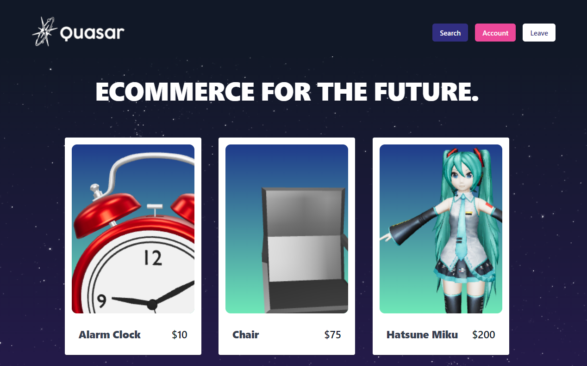
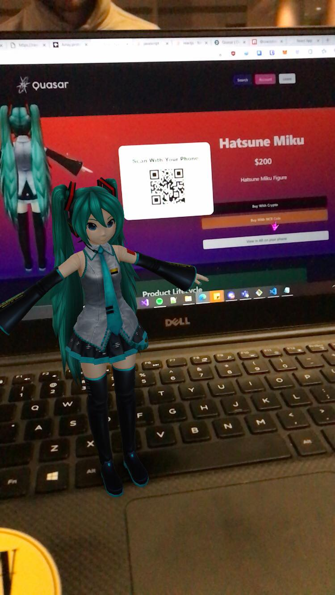

# Quasar

We believe that your shopping should be as smart as you are. Experience an intelligent shopping platform that utilizes augmented reality (AR) and machine learning (ML) to find the product you need, all while being crypto friendly and NCR-services compatible.

# Installation Notes

1. Clone the repo
2. Run `npm install` from the project directory.
3. Download craco with command `npm i @craco/craco`
4. To start server in production mode, run `npm start`. Use `npm run dev` for development.
5. Navigate to `https://localhost:3000` in your browser.

# What It Does
- **Modernizes** the digital shopping experience, leveraging augmented reality (AR) and machine learning (ML) techniques to bring digital shopping to your physical world
- **Visualizes** products in their own physical environment through 3D product models and augmented reality
- **ML-powered** smarter search - users can search for products by scanning images of related products, eliminating the need for keyword searches
- Have **peace of mind** knowing the user will receive top quality products verified through a private blockchain acting as a quality control ledger for products
- Enables **crypto payments** for products, enabling a larger audience to purchase products
- **Blockchain-based** QC ledger to keep track of the lifecycle of a product from manufacturing to production to store shelves

# Inspiration
As brick-and-mortar stores close across the country, beaten by online retail giants like Amazon and Walmart, shoppers are forced to purchase online. While digital shopping can be more convenient and accessible to millions, consumers miss out on the interaction with products in their own physical environment and finding products can be tough when you do not know what to search for. This is why we have created **Quasar**, a web app available on desktop, iOS, and Android that uses augmented reality, machine learning, blockchain, and crypto to modernize shopping - making a new interplay between the physical world and digital shopping platforms.

# How We Built It
1. ReactJS
2. 3D models & Augmented Reality (using Echo3D)
3. Authentication & Database (using Firebase)
4. Machine Learning (using TensorFlow.js)
5. Crypto Payments (using CryptoJS)

# Team
[Ayden Marshall](https://www.linkedin.com/in/ayden-marshall-31a330172/)

[Noah Chong](https://www.linkedin.com/in/noahchong/)

[Ameya Jadhav](https://www.linkedin.com/in/ameyajadhav/)

[Jorge Aquino](https://www.linkedin.com/in/jorge-e-aquino/)

# Learn more about this project
[Devpost](https://devpost.com/software/search-project-nb92418cim0x)

[Deployed Project](https://quasar-hackgt.netlify.app)

[Figma](https://www.figma.com/file/HFacmEuHRbTkGoAGW6ij13/hackgt?node-id=0%3A1)
